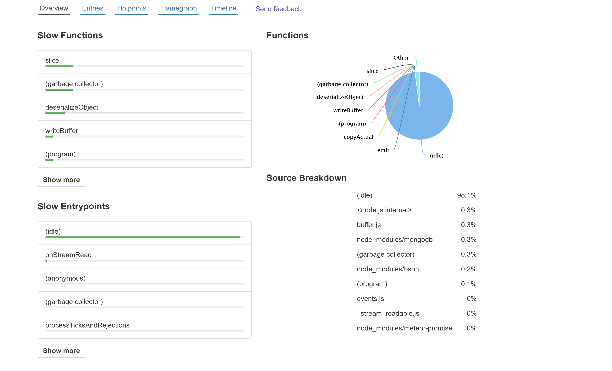

# CPU Profiler for Monti APM 


Add this package by running
```shell
meteor add montiapm:profiler
```

[](https://kadira.io/platform/kadira-debug/cpu-profiling)

This package is a fork of [kadira-profiler](https://github.com/meteorhacks/kadira-profiler)

## Remote CPU

1. On [Monti APM](https://app.montiapm.com), select your app, and go to the `Tools` tab
2. Create a new profile. Enter in a name and select a duration
3. Open your app, and run the code Monti APM gave you in the browser's console.

Your profile will now appear on Monti APM where you can analyze it.

## Local CPU

1. Run your app with the following environment variable.

```shell
MONTI_PROFILE_LOCALLY=1
```
>We've also kept `KADIRA_PROFILE_LOCALLY` for backwards compatibility

2. Open your app in the browser and open the browser console
3. In the console run `Monti.profileCpu(10)`
4. It will profile your app for 10 seconds and save the profile to a temporary location. Check your app's logs for the location.
5. In Chrome open `chrome://inspect`, and select `Open dedicated DevTools for Node`
6. Click the `Profile` tab, `Load`, and then open the file in the temporary location from step 4.

You can now analyze your cpu profile using Chrome's dev tools.

<!-- Then visit [Kadira Debug](http://debug.kadiraio.com/debug?tab=cpu-profiler) and load the saved CPU profile.  -->

For more infomation [visit here](https://kadira.io/platform/kadira-debug/cpu-profiling).
